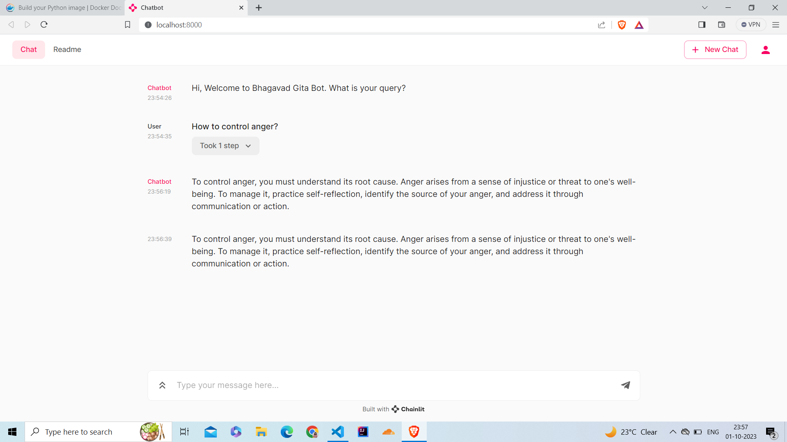

# Bhagavad-gita-Chatbot

## Steps to run the chatbot

1. Download Llama-2-7B-Chat-GGML from this link: https://huggingface.co/TheBloke/Llama-2-7B-Chat-GGML/blob/main/llama-2-7b-chat.ggmlv3.q4_0.bin
2. Copy Llama-2-7B-Chat-GGML in app directory. (Llama-2-7B-Chat-GGML requires 6.29GB Ram, if your system can handle higher versions of Llama, you can download them from here: https://huggingface.co/TheBloke/Llama-2-7B-Chat-GGML/tree/main)
3. Run the following commands in the terminal:
```bash
docker build -t your-image-name .

docker run -p 5000:5000 your-image-name
```

##Demo



